# Nagios Redfish API Integration: Out-of-band (BMC) based Monitoring

## Introduction

[Nagios](https://www.nagios.org/) is commonly used industry tool for HPC infrastructure monitoring including hosts and associated hardware components, networks, storages, services, and applications. However, there are significant issues with traditional Nagios over all solution including:

* Nagios requires human intervention for the definition and maintenance of remote hosts configurations in Nagios Core. 

* It requires Nagios Remote Plugin Executor (NRPE) on Nagios Server and each monitored remote host. 

* It also mandates Nagios Service Check Acceptor (NSCA) on each monitored remote host.

* And also requires Check specific agents (e.g. SNMP) on each monitored remoted host.


In order to address these issues, I have integrated Distributed Management Task Force (DMTF)’s [Redfish API](https://redfish.dmtf.org) with Nagios core. DMTF's Redfish API is an open industry standard specification and schema designed to meet the expectations of end users for simple, modern and secure management of scalable platform hardware. Redfish API is essentially out-of-band protocol which is implemented in baseboard management controller (BMC) of the High Performance Computing (HPC) system. Redfish-based plugins for Nagios will be directly communicating to BMC so it eliminates the requirement of any agent and configuration on remote hosts. Redfish API integration with Nagios is potentially a huge paradigm shift in Nagios based monitoring in terms of:

*	simplifying communication between Nagios server and monitored hosts; and 

*	eliminating computational cost & complexity of running Nagios native protocols (NRPE & NSCA) and other agents (SNMP) on the monitored hosts.

The following diagram shows that architecture of Nagios Redfish API integration.

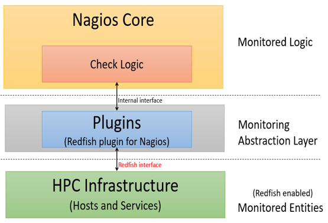

It consists of three layers: 

1. Nagios core is a configurable monitoring framework which supports thousands of monitoring plugins. It does check scheduling, check execution, check processing, event handling, and alerting.

2. Plugins are compiled executables or scripts and act as an abstraction layer between the monitoring logic present in the Nagios Core and HPC infrastructure.

3. HPC infrastructure consists of Redfish-enabled hosts, host components (e.g. BMC, CPU, memory, storage), services, and applications. Redfish-enabled HPC implies that HPC host’s BMC supports Redfish API.  Nagios Core communicates to Redfish API plugins via internal interface. In turn, plugins communicate to HPC monitored entities via Redfish APIs.

----

## Instllation Prerequisites	

This project assumes that Redfish API enabled BMC endpoints are configured and available. Alternatively or in addition, a simulated environment with [Redfish Mockup servers](https://github.com/DMTF/Redfish-Mockup-Server) may be used for testing and development of plugins.

This user guide assumes CentOS 7.4 for the installation of Nagios Core and Redfish-based plugins. However, other Linux distributions (e.g. Ubuntu) are also supported.

The examples given make use of [jq](https://stedolan.github.io/jq/) to parse JSON output from Redfish calls. This should be available in the Nagios enviornment, or another JSON parser may be used with appropriate changes to the plugins.

----


## Nagios Core Installation

Nagios Core is installed on CentOS as described @ https://support.nagios.com/kb/article/nagios-core-installing-nagios-core-from-source-96.html#CentOS . 

*Note: This project doesn’t require installation of Nagios plugins, so it can be skipped. In case you are not root user, use "sudo" to execute the commands below.*

### Security-Enhanced Linux

This guide is based on SELinux being disabled or in permissive mode. Steps to do this are as follows.

```
sed -i 's/SELINUX=.*/SELINUX=disabled/g' /etc/selinux/config
setenforce 0
```

### Nagios Core Installation Prerequisites

Perform these steps to install the pre-requisite packages.

```
yum install -y gcc glibc glibc-common wget unzip httpd php gd gd-devel perl postfix
```

### Downloading the Nagios Core Source

```
cd /tmp
wget -O nagioscore.tar.gz https://github.com/NagiosEnterprises/nagioscore/archive/nagios-4.4.1.tar.gz
tar xzf nagioscore.tar.gz
```

### Compile

```
cd /tmp/nagioscore-nagios-4.4.1/
./configure
make all
```

### Create User and Group

This creates the nagios user and group. The apache user is also added to the nagios group.

```
make install-groups-users
usermod -a -G nagios apache
```

### Install Binaries 

This step installs the binary files, CGIs, and HTML files.

```
make install
```

### Install Service / Daemon

```
make install-daemoninit
systemctl enable httpd.service
```

### Install Command Mode

This installs and configures the external command file.

```
make install-commandmode
```

### Install Configuration Files

This installs the *SAMPLE* configuration files. These are required as Nagios needs some configuration files to allow it to start.

```
make install-config
```

### Install Apache Config Files

This installs the Apache web server configuration files. Also configure Apache settings if required.

```
make install-webconf
```

### Configure Firewall

You need to allow port 80 inbound traffic on the local firewall so you can reach the Nagios Core web interface.

```
firewall-cmd --zone=public --add-port=80/tcp
firewall-cmd --zone=public --add-port=80/tcp --permanent
```

### Create nagiosadmin User Account

You'll need to create an Apache user account to be able to log into Nagios.

The following command will create a user account called nagiosadmin and you will be prompted to provide a password for the account.

```
htpasswd -c /usr/local/nagios/etc/htpasswd.users nagiosadmin
```

When adding additional users in the future, you need to remove -c from the above command otherwise it will replace the existing nagiosadmin user (and any other users you may have added).

### Start Apache Web Server

```
systemctl start httpd.service
```

### Start Nagios Core Service / Daemon

This command starts Nagios Core.

```
systemctl start nagios.service
```

### Test Nagios Core Installation

Nagios is now running, to confirm this you need to log into the Nagios Web Interface.

Point your web browser to the ip address or FQDN of your Nagios Core server, for example:

```
http://ip address/nagios
```

You will be prompted for a username and password. The username is nagiosadmin (you created it in a previous step) and the password is what you provided earlier.

")

You are done with Nagios Core Installation :thumbsup:

----


## Nagios Core Specific Configuration

### Replacing “objects” directory

This setup requires to use the pre-configured configuration files in objects directory available in this repository. To use pre-configured settings, replace the default objects directory at path: usr/local/nagios/etc/objects/ with the objects directory in this repository. The objects directory in this repository includes all the configuration files in the default objects directory. The only difference is that the configuration files in the repository objects directory are preconfigured. This objects directory also adds hosts.cfg file which contains hosts and services information. 2nd step of configuring hosts for Nagios monitoring (below) describes procedures regarding generation of hosts and related services related information in hosts.cfg.

### Auto-generating hosts and services informations for Nagios monitoring

In order to enable Redfish-based Nagios monitoring of all hosts and related services, host information and service information are defined in hosts.cfg. This process consists of two steps:

1.	Acquiring host names and IP addresses of host BMCs: This document does not mandate a specific mechanism to acquire BMC addresses and host names. There could be many ways to acquire BMC addresses including BMC IP addresses from the OpenHPC installation recipe, Redfish discovery capability, derivation (i.e. mapping) of BMC IP addresses from OpenHPC master nodes’ hosts information (i.e. /etc/hosts/) from master node of OpenHPC. Host names and BMC IP addresses are stored in nagios_node_config.conf file. The new hosts, which need to be configured for Nagios monitoring are listed in [new_nodes] section. Host’s information are listed comma separated as ‘IP:hostname’:

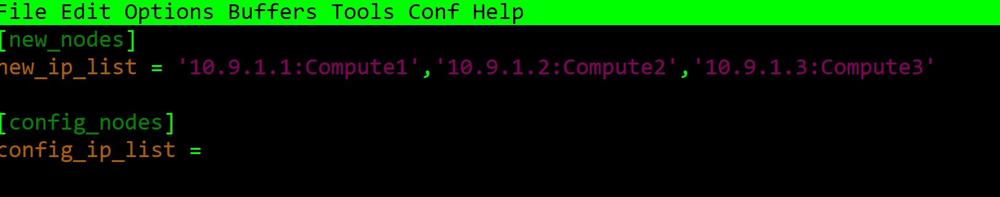

2.	nagnodeconfig.py reads the host names and BMC IP addresses from nagios_node_config.conf file and defines host information and related services in hosts.cfg file (in objects directory). 
		 
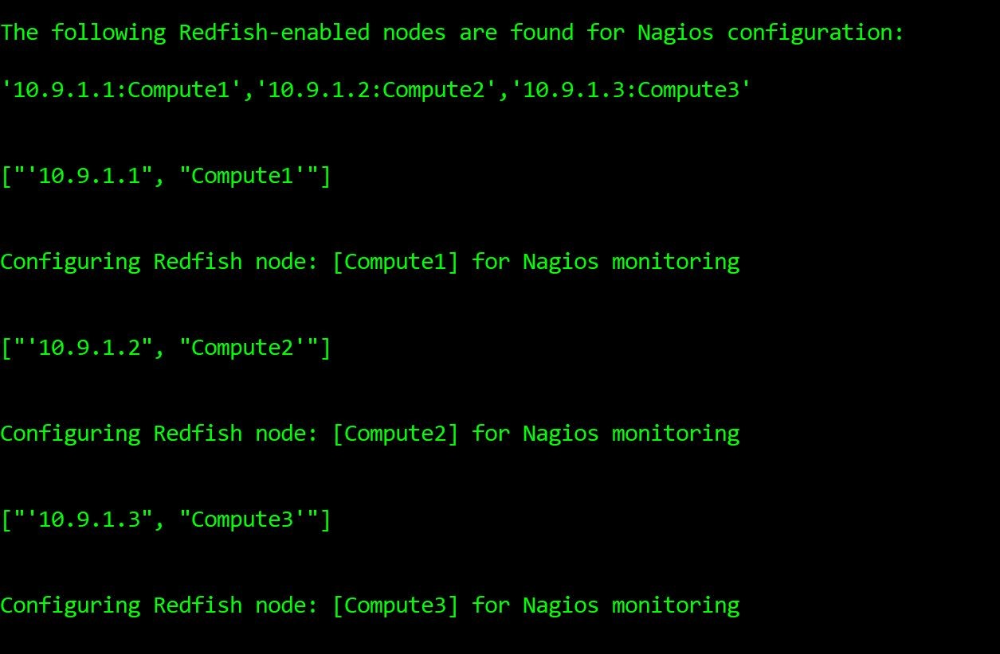

As a successful outcome of step 2 (above), the host information (first host) including host name and BMC IP address in hosts.cfg is defined as shown below:

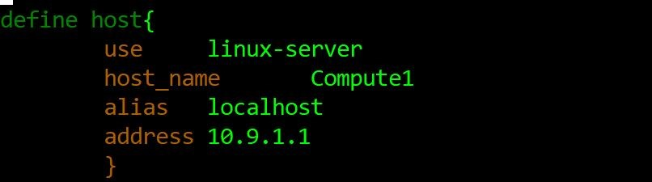

As a successful outcome of step 2 (above), the service information (one of service of compute 1) including host name and check_command in hosts.cfg is defined as shown below:


### Replacing “nagios.cfg” file

This setup requires to use the pre-configured nagios.cfg available in this repository. To use pre-configured nagios.cfg, replace the default nagios.cfg at path: usr/local/nagios/etc/ with the nagios.cfg in this repository. There is no difference between nagios.cfg in this repository and default nagios.cfg except nagios.cfg in the repository adds hosts.cfg path as shown below.

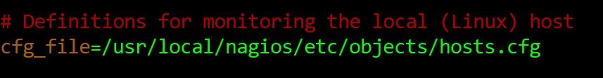


You are done with Nagios Core Nagios Core Configurations :thumbsup:

----

## Redfish-based Plugins and their Deployment

The following is the list of the Redfish-based plugins currently supported.


### Check BMC Health

This plugin monitors BMC health status using Redfish API.

### Check Host Health 

This plugin monitors host health rollup status using Redfish API.

### Check CPU Health 

This plugin monitors CPU health status using Redfish API.

### Check Memory Health 

This plugin monitors host memory rollup status using Redfish API.

### Check Fans Health 

This plugin monitors fans health status and their speed in revolutions per minute (RPM) using Redfish API.

### Check Temperature 

This plugin monitors CPU temperature using Redfish API.


### Source code View of Check Temperature Plugin:

The source code of check Temperature plugin is shown below:

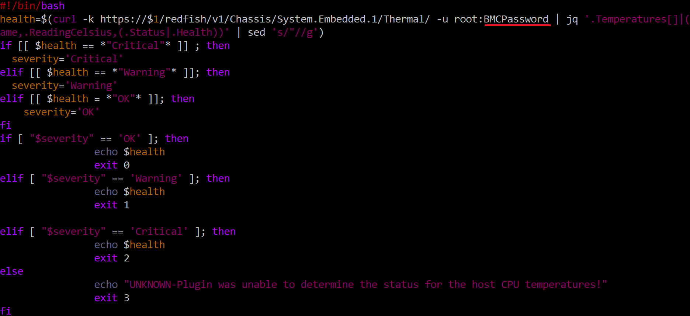

*NOTE: For the sake of successful execution of the plugins, it is required to change the password of the BMC in the Redfish command as underlined above (in red color) in all plugins.*

### Deploying Redfish-based Plugins

All the Redfish-based plugins located in redfishplugins directory in this repository are moved to path: /usr/local/nagios/libexec/

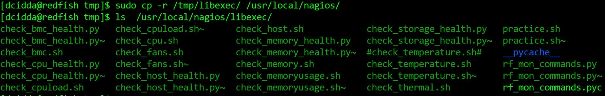

All the plugins need to change the ownership and executable rights using the following commands:

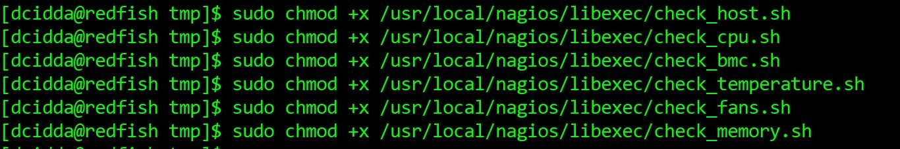

You are done with deployment of Redfish plugins :thumbsup:

----

## Verifying Nagios Configuration

https://assets.nagios.com/downloads/nagioscore/docs/nagioscore/3/en/verifyconfig.html

```
/usr/local/nagios/bin/nagios -v /usr/local/nagios/etc/nagios.cfg
```

The successful outcome of above command is expected to be 0 errors and 0 warning.

----

## Re-starting Nagios Server and Nagios Server Web Interface

After verifying Nagios configuration, Nagios Core is ready to start monitoring information of hosts and related services.

### Restart Apache Service

```
systemctl restart httpd.service
```

### Restart Nagios Service:

```
systemctl restart nagios.service
```

Nagios is now running, to see the host and their services log into the Nagios Web Interface.


### Nagios Web Interface

Point your web browser to the ip address or FQDN of your Nagios Core server, for example:

```
http:// Nagios server IP address/nagios
```

You will be prompted for a username and password. The username is nagiosadmin (you created during installation) and the password is what you provided earlier.

Once you have logged in you are presented with the Nagios interface.


### Nagios Dashboard

Once The following diagram shows the Nagios dash board where admin can have summary of status of hosts and their services in terms of UP/Down (hosts) & OK/Warning/Critical (services).

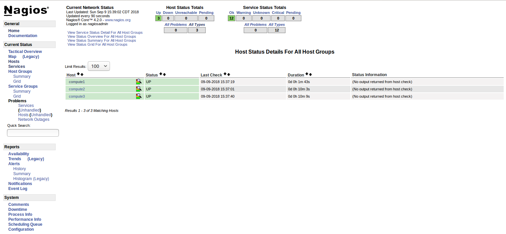

### Host View

The following diagram shows the host status

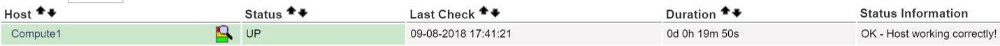

### Host services View

The following diagram shows the status of services attached to a host:

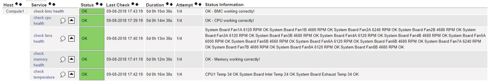

### Nagios Performance View

The following diagram shows the Nagios performance. The check latency is zero and check execution time varies from 0.54 sec to 61.01 sec.

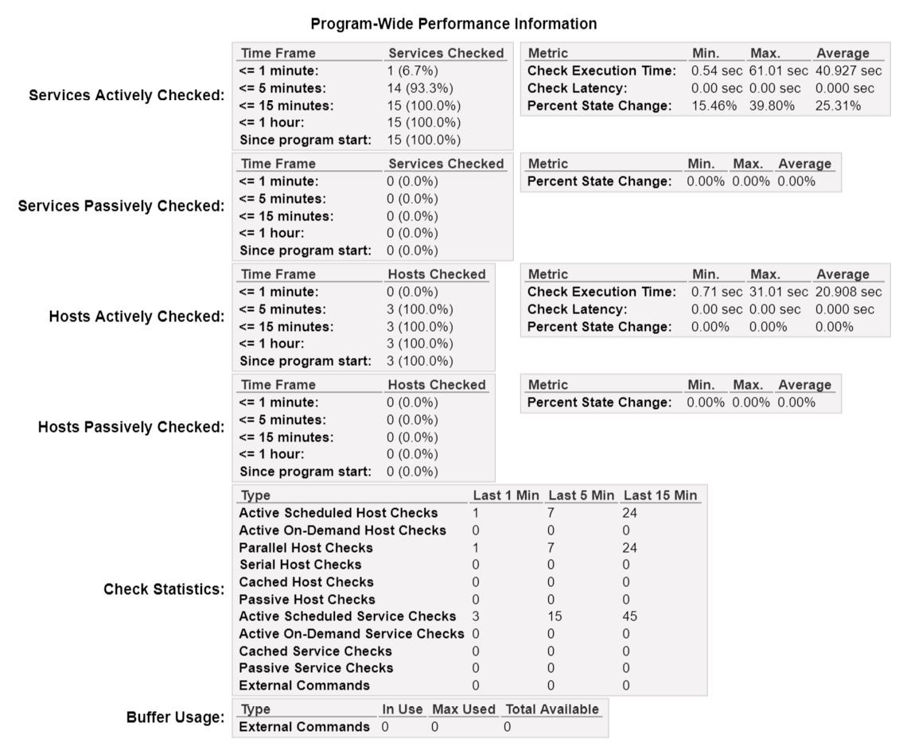

Enjoy monitoring your network with DMTF Redfish API and Nagios Core. :smile:

----

## Technical Support

In case of any technical issue in reproducing these results, you are welcome to contact Texas Tech University (TTU) developer: ghazanfar.ali@ttu.edu  

----

## Authors and Contributors

* Mr. Jon Hass, SW Architect, [Dell Inc.](https://www.dellhpc.org/)

* Mr. Ghazanfar Ali Sanpal, PhD student, [CS Dept, Whitacre College of Engineering, Texas Tech University](http://www.depts.ttu.edu/cs/)

* Dr. Alan Sill, Managing Director, [High Performance Computing Center, Texas Tech University](http://www.depts.ttu.edu/hpcc/)

* Dr. Yong Chen, Associate Professor, [CS Dept, Whitacre College of Engineering, Texas Tech University](http://www.depts.ttu.edu/cs/)

----

##  License

This project is licensed under [BSD 3-Clause License](https://github.com/nsfcac/Nagios-Redfish-API-Integration/blob/master/LICENSE)

----

## Acknowledgments

Thanks to Dell, Inc, DMTF Redfish Forum, and Nagios.org for their continuous support and contributions for the development, deployment and testing of this work.


----
